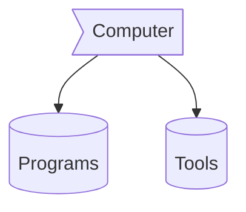

# 
</img> HOLA SOY EYNOR , </img>

&nbsp;***About me ....***

✔ Callme: ***He/His*** or ***TeamWorker*** 😊  
✔ I’m currently Developing a youtube spam comments filtering tool for **Sinhala language** 
✔ I’m currently learning about **deep learning**🥰 
✔ I’m looking to collaborate with any **Open - Source data science projects** 
✔ Ask from me anything you want, If I am alive I will answer within seconds 😉 
✔ Fun fact : *I Always try to learn something new and then sleep till it store in the brain* 😎    

  
  

  

   
### Computer :> Programs && Tools

-  **Vscode** not for web it for everything
-  Chromium base web browser like **Firefox** 
-  <a href="https://getpaint.net">**Gimp**</a> for image manipulation
-  linux I highly prefer Arch. but, sometimes you can rely on debiun. so, **PopsOs** by (System76)
